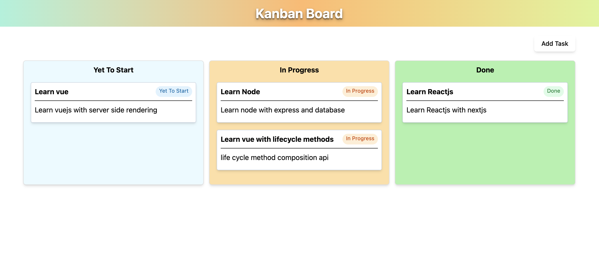

# 🗂️ Kanban Board — Vue 3

A lightweight **Kanban Board** built using **Vue 3 (Composition API)** and **TypeScript**.
The project demonstrates clean state management, native drag-and-drop handling, and practical UX decisions without relying on heavy libraries.

This was built as a **machine-coding / interview exercise** with a focus on correctness, clarity, and maintainability.

## 📸 Screenshot

<p align="center">
  
</p>

---

## 🔍 Demo Overview

**Core capabilities**

* Create tasks with title and description
* Move tasks between columns using drag and drop
* Rename columns inline
* Persist data across reloads using `localStorage`

**Columns**

* To-Do
* In-Progress
* Done

---

## ✨ Features

### Core Features

* Reactive task management using Vue 3 Composition API
* Native HTML5 drag-and-drop (no external libraries)
* Instant UI updates on state change
* Clean and minimal UI

### Bonus Features

* Column title inline editing
* Persistent tasks and column names via `localStorage`
* Type-safe state using TypeScript
* Clear separation of state, UI, and behavior

---

## 🛠️ Tech Stack

* **Vue 3**
* **Composition API**
* **TypeScript**
* **HTML5 Drag & Drop API**
* **localStorage**
* **Tailwind CSS (utility-first styling only)**

> No drag-drop libraries.
> No UI frameworks.
> Focus is on fundamentals.

---

## 📁 Project Structure

```
src/
├── Board.vue        # Main Kanban board logic
├── AddTask.vue     # Task creation modal
├── types.ts        # Shared TypeScript types
├── constant.ts     # Status constants & storage keys
```

---

## 🧠 Design & Architecture Decisions

### Why native drag-and-drop?

* Keeps logic transparent and debuggable
* Demonstrates understanding of browser APIs
* Avoids unnecessary abstractions for a small app

---

### Why `ref` instead of `computed` for column titles?

Column titles are **user-editable state**, not derived values.
`computed` is meant for derived data, so `ref` is the correct choice.

---

### Why `as const` instead of enums?

* Enums emit runtime JavaScript
* `as const` keeps types and values aligned
* Works well with modern frontend build setups

---

### Why filter tasks per column?

Tasks are stored once and rendered per column using status filtering.
This avoids duplication and keeps state normalized.

---

## 🔄 State Flow (High Level)

1. Tasks live in a single reactive array
2. Each task has a `status`
3. Columns render tasks by filtering on `status`
4. Drag-and-drop updates the task’s status
5. Updated state is persisted to `localStorage`

---

## 💾 Persistence

* Tasks are saved after add and drag operations
* Column titles are saved after edit
* State restores automatically on page reload

---

## ▶️ Getting Started

```bash
npm install
npm run dev
```

Open the browser and start managing tasks.

---

## 📌 Possible Enhancements

* Edit and delete tasks
* Keyboard-accessible drag and drop
* Extract `<BoardColumn />` as a reusable component
* Add unit tests for state logic

---

## 🎯 What This Project Demonstrates

* Strong understanding of Vue 3 Composition API
* Clean TypeScript usage without over-engineering
* Practical UX decisions
* Ability to build features from scratch without libraries
* Interview-ready problem solving

---

## 📄 License

MIT License
Free to use for learning and portfolio purposes.

